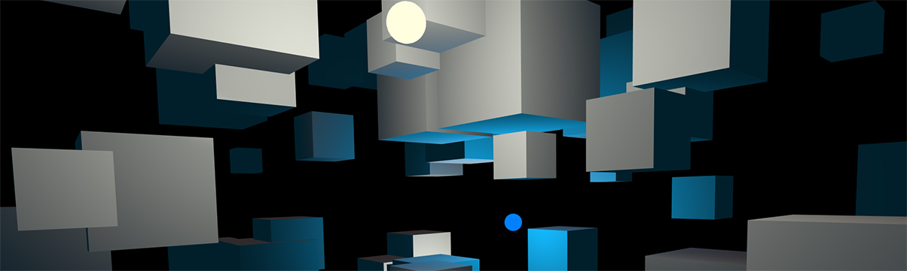
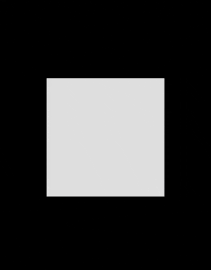
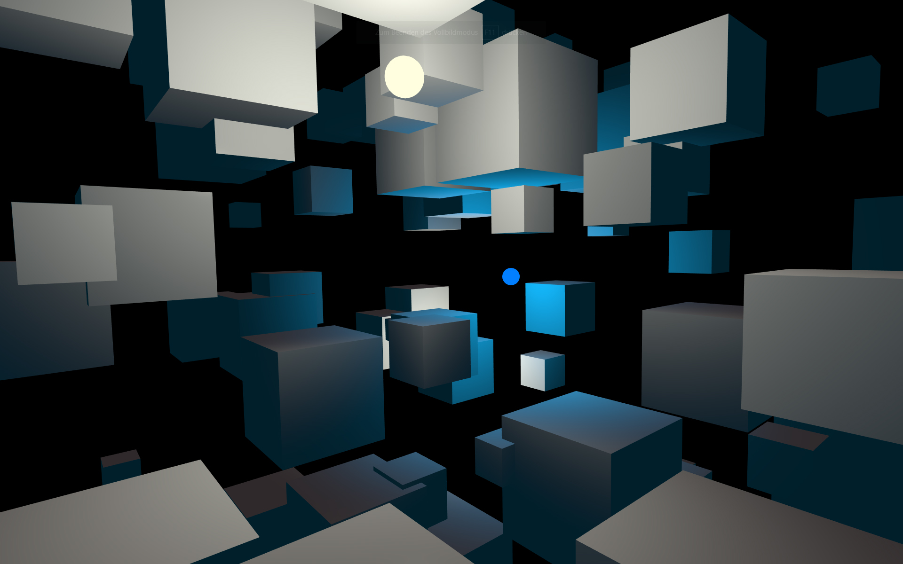
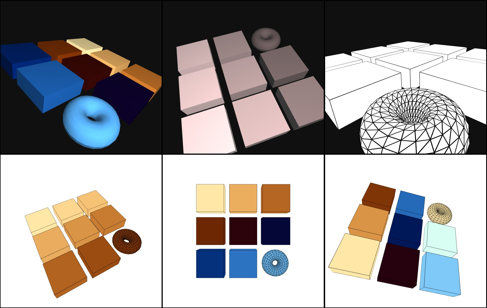
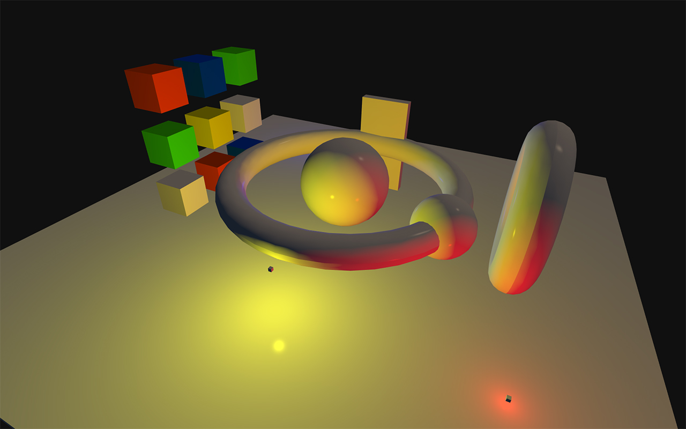
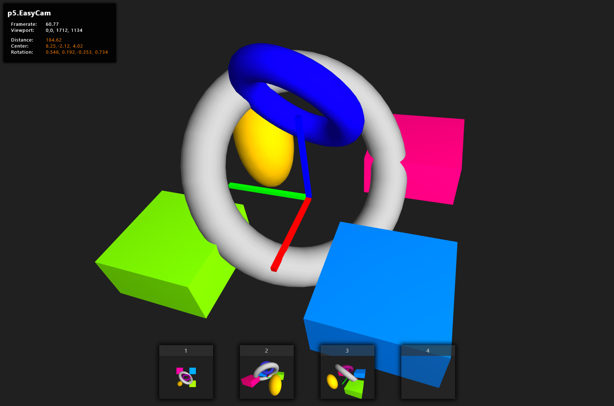

## p5.EasyCam

Simple 3D camera control for [p5js](https://p5js.org/) and the WEBGL renderer.

To get started quickly with EasyCam, take a look at the following tutorial on OpenProcessing.org:

--> [openprocessing tutorial](https://www.openprocessing.org/sketch/756182)


### Releases

- [p5.easycam.js](https://freshfork.github.io/p5.EasyCam/p5.easycam.js)
- [p5.easycam.min.js](https://freshfork.github.io/p5.EasyCam/p5.easycam.min.js)
- [CDN: p5.easycam.min.js](https://cdn.jsdelivr.net/gh/freshfork/p5.EasyCam@1.0.10/p5.easycam.min.js)
- [All Releases](https://github.com/freshfork/p5.EasyCam/releases)


### Examples

#### EasyCam.js - Advanced Shader/Lighting
- [RandomBoxes](https://freshfork.github.io/p5.EasyCam/examples/RandomBoxes/)
- [AnimatedPointLights](https://freshfork.github.io/p5.EasyCam/examples/AnimatedPointLights/)
- [PerPixelPhong](https://freshfork.github.io/p5.EasyCam/examples/PerPixelPhong/)

#### EasyCam.js - Basic
- [CameraStates](https://freshfork.github.io/p5.EasyCam/examples/CameraStates/)
- [CameraStates_Basic](https://freshfork.github.io/p5.EasyCam/examples/CameraStates_Basic/)
- [HeadUpDisplay](https://freshfork.github.io/p5.EasyCam/examples/HeadUpDisplay/)
- [QuickStart](https://freshfork.github.io/p5.EasyCam/examples/QuickStart/)
- [QuickStart_Ortho](https://freshfork.github.io/p5.EasyCam/examples/QuickStart_Ortho/)
- [SplitView](https://freshfork.github.io/p5.EasyCam/examples/SplitView/)
- [MultiView](https://freshfork.github.io/p5.EasyCam/examples/MultiView/)

#### Alternate first-person camera

If you are seeking a simple first-person point-of-view camera library for p5.js, take a look at p5.RoverCam
- [p5.RoverCam](https://github.com/freshfork/p5.RoverCam)


### Usage

```javascript
function setup() { 
  createCanvas(windowWidth, windowHeight, WEBGL);
  
  // the simplest method to enable the camera
  createEasyCam();

  // suppress right-click context menu
  document.oncontextmenu = function() { return false; }
} 

function draw(){
  background(64);
  lights();
  box(200);
}
```
To control the movement of the camera:

**rotate** around the look-at point  
mouse: left-click and drag  
touch: one-finger drag  

**pan** the scene  
mouse: middle-click and drag  
touch: two-finger drag  

**zoom** out/in  
mouse: right-click drag  
touch: pinch/spread  

**reset** to the starting state  
mouse: double-click  
touch: double-tap  



The camera is positioned on a sphere whose radius is a given distance from the look-at point. Rotations are around the looked-at point.

EasyCam is impervious to gimbal lock, and has no known “singularities” or discontinuities in its behavior.

Simple examples to play with:
- [jsfiddle](https://jsfiddle.net/intrinsica/n95sgbvr/)
- [p5editor](https://editor.p5js.org/jwdunn1/sketches/Awjm6VpHo)
- [openprocessing](https://www.openprocessing.org/sketch/749740)
- [vue.js integration](https://jsfiddle.net/intrinsica/7rt695bs/13/)

### History

This library is a derivative of the original PeasyCam Library by Jonathan Feinberg 
and combines new useful features with the great look and feel of the original version.
This p5js library was started by Thomas Diewald in 2017. It has been updated to work
with the latest p5js version 0.10.2 and will be maintained going forward.

Processing/Java version of this project: https://github.com/diwi/peasycam/tree/PeasyCam3

Original (presumed abandoned) fork source: https://github.com/diwi/p5.EasyCam

### Reference Documentation

[p5.EasyCam.documentation](https://github.com/freshfork/p5.EasyCam/blob/master/documentation/p5.easycam.docs.md)


## Quick Reference

### Camera Setup

```javascript
// constructor
new Dw.EasyCam(p5.RendererGL, state);
new Dw.EasyCam(p5.RendererGL, {
      distance : z,                 // scalar (optional)
      center   : [x, y, z],         // vector (optional)
      rotation : [q0, q1, q2, q3],  // quaternion (optional)
      viewport : [x, y, w, h],      // array (optional)
    }

// examples
createEasyCam(); // uses the primary WEBGL renderer and default settings
 ...
createEasyCam({distance:z});
createEasyCam(p5.RendererGL);
createEasyCam(p5.RendererGL, {distance:z});
createEasyCam(p5.RendererGL, {distance:z, center:[x,y,z]});
  ... 
new Dw.EasyCam(p5.RendererGL);
new Dw.EasyCam(p5.RendererGL, {distance:z});
new Dw.EasyCam(p5.RendererGL, {distance:z, center:[x,y,z]});
  ... 
```

The constructors above return an EasyCam object whose methods are listed below.

### Camera Methods

```javascript
// CAMERA, MISC
setCanvas(renderer) // webgl-renderer
getCanvas()
setViewport(viewport) // viewport as bounding screen-rectangle [x,y,w,h]
getViewport()
update() // update camera state
apply(renderer) // apply camera state to webgl-renderer
dispose()
setAutoUpdate(status)
getAutoUpdate()
attachMouseListeners(renderer) // input handler
removeMouseListeners()

// INPUT BEHAVIOUR/SCALE/SPEED
setZoomScale(scale_zoom)
getZoomScale()
setPanScale(scale_pan)
getPanScale()
setRotationScale(scale_rotation)
getRotationScale()
setWheelScale(wheelScale)
getWheelScale()
setDefaultInterpolationTime(duration)
setDamping(damping)
setRotationConstraint(yaw, pitch, roll)

// GET ZOOM/PAN/ROTATE/POSITION/UP
getCenter()
getDistance()
getRotation()
getUpVector(dst)
getPosition(dst)

// SET ZOOM/PAN/ROTATE
setDistanceMin(distance_min)
setDistanceMax(distance_max)
setDistance(distance, duration)
setCenter(center, duration)
setRotation(rotation, duration)
setInterpolatedCenter(valA, valB, t)
setInterpolatedDistance(valA, valB, t)
setInterpolatedRotation(valA, valB, t)

// MODIFY ZOOM/PAN/ROTATE
zoom(dz)
panX(dx)
panY(dy)
pan(dx, dy)
rotateX(rx)
rotateY(ry)
rotateZ(rz)
rotate(axis, angle)

// CAMERA STATES
setState(other, duration)
getState()
pushState()
popState(duration)
pushResetState()
reset(duration)

// HEAD_UP_DISPLAY
beginHUD(renderer, w, h)
endHUD(renderer)
```

### Camera State Object

```javascript
var easy=createEasyCam();
let state = {
  distance : z,                 // scalar
  center   : [x, y, z],         // vector
  rotation : [q0, q1, q2, q3],  // quaternion
};
easy.setState(state, 1000); // animate to state over the period of 1 second
```

Example: [openprocessing](https://www.openprocessing.org/sketch/622115)


## Screenshots








